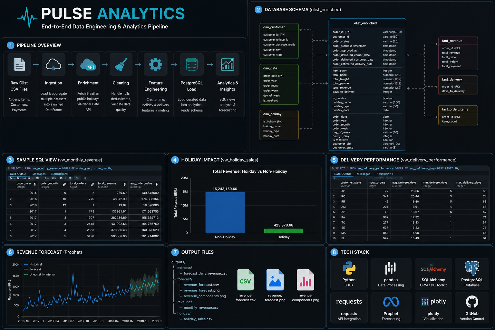
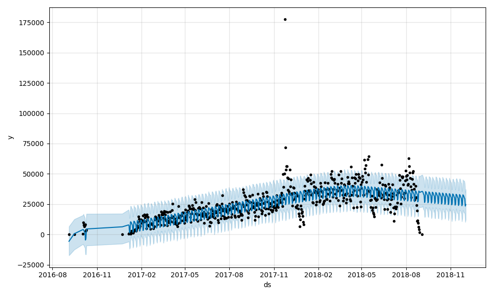
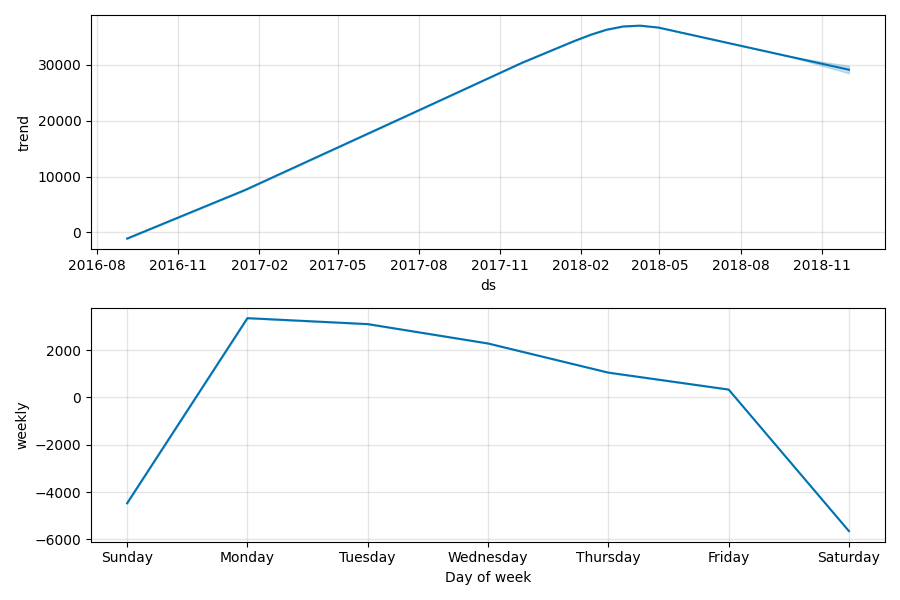

# Pulse Analytics

### End-to-End Data Engineering & Analytics Platform for E-Commerce Intelligence


---

# Project Overview



Pulse Analytics is an end-to-end Data Engineering and Analytics platform built using the Brazilian Olist E-Commerce dataset.

The project transforms raw transactional data into an analytics-ready warehouse enriched with public holiday intelligence, engineered business features, SQL reporting layers, and machine-learning-based revenue forecasting.

The solution demonstrates production-style ETL development, data quality validation, relational modeling, business intelligence reporting, and time-series forecasting.

---

# Business Problem

E-commerce organizations need reliable visibility into:

* Revenue trends
* Holiday sales performance
* Delivery efficiency
* Geographic sales distribution
* Customer purchasing behavior
* Future revenue expectations

Raw operational datasets rarely provide these insights directly.

Pulse Analytics solves this by creating a complete analytics pipeline that transforms raw transactional data into decision-ready datasets.

---

# Key Business Use Cases

## Revenue Trend Analysis

Track:

* Daily revenue
* Monthly revenue
* Average order value
* Order volume trends

Business Questions:

* Which months generate the highest revenue?
* Is revenue growing over time?
* What is the average order value?

---

## Holiday Sales Impact Analysis

Analyze how public holidays influence:

* Order volume
* Revenue
* Customer purchasing behavior

Business Questions:

* Do holidays increase revenue?
* Which holidays generate the most sales?
* Are customers spending more during holidays?

---

## Delivery Performance Monitoring

Monitor fulfillment performance across regions.

Metrics:

* Average delivery days
* Fastest deliveries
* Slowest deliveries

Business Questions:

* Which states have the best delivery performance?
* Where do logistics bottlenecks exist?

---

## Geographic Revenue Analysis

Evaluate sales distribution by:

* State
* City

Business Questions:

* Which regions generate the most revenue?
* Which markets are underperforming?

---

## Revenue Forecasting

Machine Learning forecasting using Prophet enables:

* Revenue prediction
* Trend detection
* Seasonality analysis

Business Questions:

* What revenue can be expected over the next 90 days?
* Are there identifiable seasonal patterns?

---

# Architecture

```text
                    ┌───────────────────┐
                    │   Olist Dataset   │
                    └─────────┬─────────┘
                              │
                              ▼
                    ┌───────────────────┐
                    │ Data Ingestion    │
                    └─────────┬─────────┘
                              │
                              ▼
                    ┌───────────────────┐
                    │ Holiday API       │
                    │ Nager.Date        │
                    └─────────┬─────────┘
                              │
                              ▼
                    ┌───────────────────┐
                    │ Data Enrichment   │
                    └─────────┬─────────┘
                              │
                              ▼
                    ┌───────────────────┐
                    │ Data Cleaning     │
                    └─────────┬─────────┘
                              │
                              ▼
                    ┌───────────────────┐
                    │ Feature Engineering│
                    └─────────┬─────────┘
                              │
                              ▼
                    ┌───────────────────┐
                    │ PostgreSQL        │
                    │ Analytics Layer   │
                    └─────────┬─────────┘
                              │
          ┌───────────────────┼───────────────────┐
          ▼                   ▼                   ▼
┌─────────────────┐ ┌─────────────────┐ ┌─────────────────┐
│ SQL Reporting   │ │ Revenue Analysis│ │ Forecasting     │
│ Views           │ │ Scripts         │ │ Prophet ML      │
└─────────────────┘ └─────────────────┘ └─────────────────┘
```

---

# Data Pipeline Workflow

## Phase 1 — Data Ingestion

Sources:

* Orders
* Customers
* Order Items
* Payments

Processing:

* Payment aggregation
* Item aggregation
* Dataset consolidation

Output:

~100,000 enriched order records

---

## Phase 2 — Public Holiday Enrichment

Source:

Nager.Date Public Holiday API

Endpoint:

```http
https://date.nager.at/api/v3/PublicHolidays/{year}/BR
```

Years Processed:

```python
[2016, 2017, 2018]
```

Added Features:

* holiday_name
* holiday_type
* holiday_date
* is_holiday

---

## Phase 3 — Data Quality & Validation

Validation Rules:

```python
assert df['order_id'].nunique() == len(df)

assert df['order_purchase_timestamp'].isna().sum() == 0

assert (df['total_price'] >= 0).all()
```

Quality Controls:

* Duplicate removal
* Null handling
* Datetime standardization
* Revenue validation

---

## Phase 4 — Feature Engineering

Generated Features:

| Feature          | Description        |
| ---------------- | ------------------ |
| is_holiday       | Holiday indicator  |
| order_year       | Purchase year      |
| order_month      | Purchase month     |
| order_week       | ISO week           |
| day_of_week      | Weekday            |
| hour_of_day      | Purchase hour      |
| is_weekend       | Weekend flag       |
| total_revenue    | Revenue metric     |
| days_to_delivery | Delivery lead time |

---

## Phase 5 — PostgreSQL Warehouse Load

Technology:

* PostgreSQL
* SQLAlchemy

Load Strategy:

1. Create table
2. Truncate existing records
3. Reload fresh dataset
4. Preserve indexes

Rows Loaded:

~98,000+ records

---

# Analytics Data Model

## Fact Table

### olist_enriched

Contains:

* Orders
* Customers
* Revenue
* Delivery metrics
* Holiday attributes
* Time dimensions

Primary Key:

```sql
order_id
```

---

# SQL Reporting Layer

The warehouse exposes reusable analytical views.

## Revenue Views

```sql
vw_daily_revenue
vw_monthly_revenue
```

---

## Holiday Views

```sql
vw_holiday_sales
vw_holiday_details
```

---

## Delivery Views

```sql
vw_delivery_performance
```

---

## Geographic Views

```sql
vw_state_sales
vw_city_sales
```

---

# Forecasting

Technology:

* Prophet
* Pandas
* Matplotlib

Forecast Horizon:

```python
90 Days
```

Outputs:

```text
outputs/forecast/

├── revenue_forecast.csv
├── revenue_forecast.png
└── revenue_components.png
```

Generated Insights:

* Trend
* Weekly seasonality
* Long-term growth projections

---

# Results

## Revenue Summary

| Metric              | Value  |
| ------------------- | ------ |
| Total Revenue       | 15.67M |
| Orders              | 97K+   |
| Holiday Orders      | 2.7K+  |
| Average Order Value | ~160   |

---

## Holiday Analysis

| Holiday Flag | Orders | Revenue |
| ------------ | ------ | ------- |
| False        | 95,124 | 15.24M  |
| True         | 2,764  | 423K    |

Key Finding:

Holiday periods generated meaningful revenue volume but slightly lower average order values compared to non-holiday purchases.

---

# Screenshots

## Revenue Forecast

```text
docs/images/revenue_forecast.png
```

```markdown

```

---

## Forecast Components

```markdown

```
---

# Repository Structure

```text
pulse-analytics/

├── analytics/
│   ├── revenue_analysis.py
│   ├── holiday_analysis.py
│   ├── extract_forecast_data.py
│   └── forecast.py
│
├── pipeline/
│   ├── ingest.py
│   ├── enrich.py
│   ├── clean.py
│   ├── features.py
│   ├── load.py
│   └── create_views.py
│
├── sql/
│   ├── create_table.sql
│   ├── revenue_views.sql
│   ├── holiday_views.sql
│   ├── delivery_views.sql
│   ├── geography_views.sql
│   └── validate.sql
│
├── outputs/
│   ├── extracts/
│   ├── revenue/
│   ├── holiday/
│   └── forecast/
│
├── docs/
│   ├── data_dictionary.md
│   ├── data_lineage.md
│   └── images/
│        └── project_overview.png
├── main.py
├── requirements.txt
└── README.md
```

---

# Technology Stack

## Data Engineering

* Python
* Pandas
* Requests
* SQLAlchemy

## Database

* PostgreSQL

## Analytics

* SQL
* Pandas

## Forecasting

* Prophet
* Matplotlib

## Data Sources

* Olist Marketplace Dataset
* Nager.Date API

---

# Future Enhancements

### Data Engineering

* Incremental loading
* CDC implementation
* Airflow orchestration
* dbt transformations
* Dockerization

### Cloud

* AWS RDS
* AWS S3
* AWS Glue
* Azure Data Factory
* BigQuery

### Analytics

* Power BI dashboards
* Tableau dashboards
* Streamlit application

### DevOps

* GitHub Actions
* CI/CD pipelines
* Automated testing

---

# Skills Demonstrated

* Data Engineering
* ETL Development
* Data Modeling
* PostgreSQL
* SQL Optimization
* Data Quality Validation
* API Integration
* Feature Engineering
* Business Analytics
* Forecasting
* Python Automation
* Analytics Engineering

---

# Author

**Binah Utuedor**

Data Engineer | Analytics Engineer | Business Intelligence Developer

Built to demonstrate production-style ETL pipelines, analytics engineering, SQL reporting, and forecasting workflows using Python and PostgreSQL.
