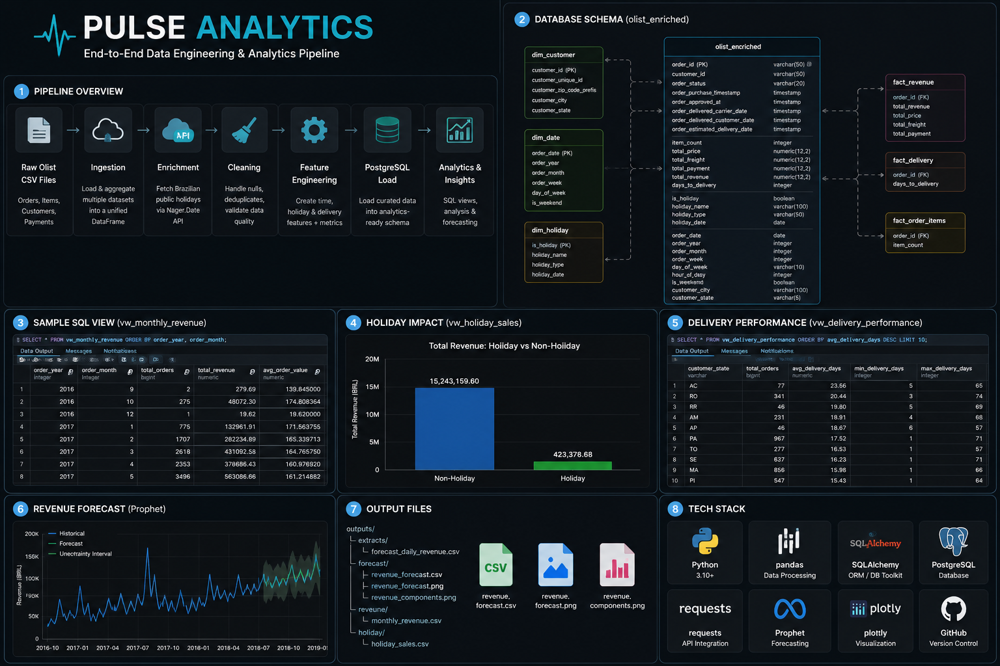

# 🚀 Pulse Analytics

### End-to-End Data Engineering & Analytics Platform for E-Commerce Intelligence


---

# 📖 Project Overview



Pulse Analytics is an end-to-end Data Engineering and Analytics platform built using the Brazilian Olist E-Commerce dataset.

The project transforms raw transactional data into an analytics-ready PostgreSQL warehouse through a production-style ETL pipeline that includes incremental data loading, API enrichment, feature engineering, data quality validation, SQL reporting layers, and machine-learning-based revenue forecasting.

The solution demonstrates modern data engineering concepts including metadata-driven incremental pipelines, idempotent loading, analytics engineering, and business intelligence reporting.

---

# 🎯 Business Problem

E-commerce organizations need reliable visibility into:

- Revenue trends
- Holiday sales performance
- Delivery efficiency
- Geographic sales distribution
- Customer purchasing behavior
- Future revenue expectations

Raw operational datasets rarely provide these insights directly.

Pulse Analytics transforms raw operational data into trusted, analytics-ready datasets that support business reporting and forecasting.

---

# 💼 Key Business Use Cases

## 📈 Revenue Trend Analysis

- Daily and monthly revenue
- Order volume trends
- Average order value

## 🎉 Holiday Sales Impact

- Holiday vs non-holiday revenue
- Holiday purchasing behaviour
- Holiday performance comparison

## 🚚 Delivery Performance

- Average delivery time
- Regional delivery performance
- Logistics monitoring

## 🗺️ Geographic Analysis

- Revenue by state
- Revenue by city
- Customer distribution

## 🔮 Revenue Forecasting

- 90-day revenue forecast
- Trend analysis
- Seasonality detection

---

# 🏗️ Architecture

```text
                    Raw Olist CSV Files
                            │
                            ▼
                 Incremental Data Ingestion
                            │
                            ▼
                  Holiday API Enrichment
                            │
                            ▼
                Data Cleaning & Validation
                            │
                            ▼
                 Feature Engineering
                            │
                            ▼
                PostgreSQL Staging Table
                            │
                            ▼
             UPSERT → Analytics Warehouse
                            │
        ┌───────────────────┼───────────────────┐
        ▼                   ▼                   ▼
   SQL Views         Analytics Scripts     Forecasting
```

---

# ⚙️ ETL Pipeline

The ETL pipeline follows a modular architecture:

1. Incremental data ingestion
2. Holiday API enrichment
3. Data cleaning
4. Data quality validation
5. Feature engineering
6. PostgreSQL loading
7. Analytics view creation
8. Business analytics
9. Revenue forecasting

---

# 🔄 Incremental Loading

Unlike a full refresh pipeline, Pulse Analytics supports **incremental loading** using a metadata-driven watermark.

### Metadata Table

```sql
pipeline_metadata

pipeline_name
last_loaded
```

Pipeline execution:

1. Read the latest watermark.
2. Load only orders newer than the watermark.
3. Load new records into a staging table.
4. Merge into the production table using PostgreSQL UPSERT.
5. Update the watermark after a successful load.

This makes the pipeline:

- Incremental
- Idempotent
- Production-ready

---

# ✅ Data Quality

Quality checks include:

- Duplicate removal
- Null validation
- Datetime standardisation
- Revenue validation
- Primary key uniqueness
- Business rule validation

Example:

```python
assert df["order_id"].nunique() == len(df)
assert df["order_purchase_timestamp"].isna().sum() == 0
assert (df["total_price"] >= 0).all()
```

---

# 🧠 Feature Engineering

Generated business features include:

| Feature | Description |
|----------|-------------|
| is_holiday | Holiday indicator |
| order_year | Purchase year |
| order_month | Purchase month |
| order_week | ISO week |
| day_of_week | Day name |
| hour_of_day | Purchase hour |
| is_weekend | Weekend flag |
| total_revenue | Revenue metric |
| days_to_delivery | Delivery lead time |

---

# 🗄️ PostgreSQL Warehouse

The analytics warehouse stores a consolidated fact table:

**olist_enriched**

Contains:

- Orders
- Customers
- Revenue metrics
- Holiday attributes
- Delivery metrics
- Engineered features

Load strategy:

- Create metadata table
- Create warehouse table
- Load staging table
- UPSERT into production
- Drop staging table
- Update metadata watermark

---

# 📊 Analytics Layer

Reusable SQL views support reporting and dashboard development.

### Revenue

- `vw_daily_revenue`
- `vw_monthly_revenue`

### Holiday

- `vw_holiday_sales`
- `vw_holiday_details`

### Delivery

- `vw_delivery_performance`

### Geography

- `vw_state_sales`
- `vw_city_sales`

---

# 🔮 Forecasting

Revenue forecasting is implemented using Facebook Prophet.

Outputs include:

```
outputs/forecast/

revenue_forecast.csv
revenue_forecast.png
revenue_components.png
```

Forecast horizon:

**90 Days**

---

# 📁 Repository Structure

```text
pulse-analytics/

├── analytics/
│   ├── revenue_analysis.py
│   ├── holiday_analysis.py
│   ├── extract_forecast_data.py
│   └── forecast.py
│
├── pipeline/
│   ├── ingest.py
│   ├── enrich.py
│   ├── clean.py
│   ├── features.py
│   ├── load.py
│   ├── metadata.py
│   └── create_views.py
│
├── sql/
│   ├── create_table.sql
│   ├── create_metadata.sql
│   ├── revenue_views.sql
│   ├── holiday_views.sql
│   ├── delivery_views.sql
│   ├── geography_views.sql
│   └── validate.sql
│
├── outputs/
├── docs/
├── main.py
├── requirements.txt
└── README.md
```

---

# 🛠️ Technology Stack

### Data Engineering

- Python
- Pandas
- SQLAlchemy
- Requests

### Database

- PostgreSQL

### Analytics

- SQL
- Pandas

### Machine Learning

- Prophet

### External Data

- Olist Dataset
- Nager.Date Public Holiday API

---

# 📈 Results

| Metric | Value |
|---------|------:|
| Total Revenue | 15.67M |
| Orders | 97K+ |
| Holiday Orders | 2.7K+ |
| Average Order Value | ~160 |

---

# 🚀 Project Roadmap

## ✅ Version 1 – Analytics Platform

- ETL pipeline
- PostgreSQL warehouse
- Holiday enrichment
- SQL reporting views
- Revenue forecasting

## ✅ Version 2 – Production Data Engineering

- Incremental loading
- Metadata-driven pipelines
- Staging tables
- UPSERT loading

## 🔄 Planned Enhancements

### Data Engineering

- Change Data Capture (CDC)
- Apache Airflow orchestration
- dbt transformations
- Docker containerisation

### Cloud

- Azure Data Factory
- Azure Database for PostgreSQL
- Azure Blob Storage

### Analytics

- Streamlit dashboard
- Power BI dashboard

### DevOps

- GitHub Actions
- CI/CD pipelines
- Automated testing with pytest

---

# 🏆 Skills Demonstrated

- Data Engineering
- ETL Development
- Incremental Data Loading
- Metadata-Driven Pipelines
- PostgreSQL
- SQL Optimization
- SQLAlchemy
- Data Warehousing
- Data Quality Validation
- Feature Engineering
- API Integration
- Analytics Engineering
- Business Intelligence
- Time-Series Forecasting
- Python Automation

---

# 👤 Author

**Binah Utuedor**

**Data Engineer | Analytics Engineer | Business Intelligence Developer**

This project demonstrates the design and implementation of a production-style analytics platform using Python, PostgreSQL, SQL, and machine learning. It showcases modern data engineering practices including modular ETL development, incremental loading, analytics engineering, and business reporting.